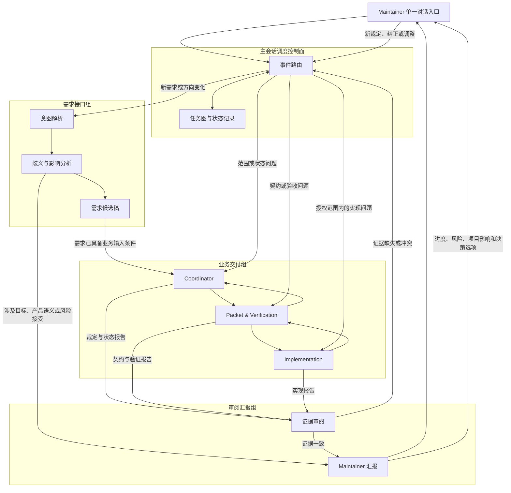

# LIMA 三智能体组架构与非线性工作流规划

> 文档类型：架构与工作流规划稿（非规范性）
>
> 面向对象：LIMA Maintainer、ZCode 主会话及后续新增的自定义 Agent
>
> 当前状态：`DRAFT / FOR ZCODE HANDOFF`
>
> 适用范围：后续新启动的 Issue、IP 和项目级讨论
>
> 不适用范围：本文件不自动改变已有 Issue、已冻结 Packet、测试、Assignment、Decision Record、PR 或现有三个业务 Agent 的职责

## 1. 目标

本规划把 LIMA 的 AI Coding 协作体系划分为三个智能体组：

1. **需求接口组**：接收 Maintainer 的自然语言，提炼目标、约束、歧义和可观察验收结果；
2. **业务交付组**：沿用 Coordinator、Packet & Verification、Implementation 三角色完成业务交付；
3. **审阅汇报组**：独立核对业务报告与证据，向 Maintainer 汇报进度、风险、后续选择和项目影响。

本体系需要同时解决以下问题：

- Maintainer 的自然语言可能不完整、有歧义或混合了目标与实现设想；
- 业务 Agent 的技术报告难以直接支持人类决策；
- Maintainer 不应被迫进入代码黑箱，对变量、函数或局部实现作选择；
- 监管 Agent 不能成为另一个 Coordinator，也不能只做业务报告的语言润色；
- 多个 Issue 和 IP 应能处于不同阶段并行运行，不能被强制串成单一流水线；
- 单个交付任务仍须遵守必要的契约、冻结、验证和合并门禁。

核心设计结论：

> **项目全局使用事件驱动、任务图式的非线性调度；单个交付单元内部继续使用有证据门禁的状态机。**

## 2. 总体结构



Maintainer 只需要面对一个对话入口。三个智能体组不直接争夺对 Maintainer 的解释权，也不直接互相下达越权指令。ZCode 主会话承担调度控制面职责，根据事件类型选择 Agent，并保存可追溯的派发和回收记录。

## 3. 设计原则

### 3.1 单一人类入口

Maintainer 的所有自然语言指令、状态询问、方向调整、授权和纠正统一进入主会话。业务 Agent 不绕过主会话直接要求 Maintainer 理解代码细节。

### 3.2 语义来源必须分层

所有需求整理必须区分：

- **Maintainer 明确表达**：可以作为权威输入；
- **基于上下文的推断**：可以用于低风险补全，但必须显式标注；
- **Agent 建议**：只能作为候选方案；
- **未确定事项**：存在多个会改变产品结果的合理答案，需要裁定。

不得把 Agent 的推断或建议写成 Maintainer 已经批准的需求。

### 3.3 权威与监督分离

- Coordinator 是业务交付控制面的唯一协调裁定者；
- P&V 是 Packet、冻结测试和独立验证的权威；
- Implementation 是授权产品实现的责任人；
- 审阅汇报组只核对“结论是否有证据”和“报告是否准确”，不替代上述权威；
- Maintainer 只处理项目方向、产品语义、重大兼容性、安全风险接受、发布和超出授权的事项。

### 3.4 事实、结论和建议分开

任何跨组报告都应分别列出：

1. 已核验事实；
2. 由事实支持的结论；
3. 尚未验证的内容；
4. Agent 建议；
5. 需要哪一角色或 Maintainer 决定。

### 3.5 无冲突工作继续运行

某个 Decision Request 或 Evidence Challenge 阻塞时，只暂停依赖该决定的工作。其他不共享文件、不依赖该契约且不受该风险影响的任务可以继续。

### 3.6 人类决定产品逻辑，不决定代码写法

需要 Maintainer 决定时，问题必须描述为：

- 什么条件会触发问题；
- 系统现在会产生什么行为；
- 该行为为什么影响用户、数据、安全、兼容性或发布；
- 每个选项会带来什么可观察结果和代价。

变量名、函数名、测试 ID 和文件路径放入证据附录，不能成为人类决策的主要语言。

## 4. 主会话调度控制面

主会话不是第四个业务权威。它负责把正确的信息交给正确的角色，并保存交接链。

### 4.1 职责

- 分类 Maintainer 输入：查询、新需求、方向调整、授权、纠正、暂停或恢复；
- 根据事件类型选择目标 Agent；
- 记录任务 ID、阶段、输入版本、完整 SHA、Owner、worktree、Agent 配置和派发时间；
- 回收 Agent 结果并生成下一事件；
- 检查调用前置条件，防止跳过必要门禁；
- 保证同一高冲突文件区域同一时刻只有一个写 Owner；
- 保证审阅 Agent 读取的是与业务报告相同的提交、Packet 和证据版本；
- 保存开放的 Decision Request、Evidence Challenge 和 Maintainer Decision；
- 将需要人类处理的事项送给审阅汇报组包装。

### 4.2 禁止事项

主会话不得：

- 擅自补充 Maintainer 没有表达的产品要求；
- 修改 Coordinator 的范围、状态或 Assignment 内容后再派发；
- 将 Implementation 的自测当成 P&V 独立验证；
- 将 PR 合并当成 IP-DONE；
- 将所有已知 IP 完成当成 Issue-DONE；
- 为减少流程步骤而跳过冻结、独立验证或 post-merge verification；
- 让一个 Agent 以另一个角色的身份完成其无权完成的工作。

## 5. 需求接口组

### 5.1 使命

需求接口组把 Maintainer 的自然语言转成可审查、可追踪、可供 Coordinator 消费的需求表达。它负责减少歧义，不负责决定 IP 的实现范围。

### 5.2 初始角色配置

第一版建议只配置一个 Agent：

**Maintainer Intent Agent**

当需求量或复杂度增大后，可以拆成：

- **Intent Analyst**：提取目标、用户价值、约束、优先级和可观察结果；
- **Requirement Challenger**：寻找歧义、隐含假设、需求冲突、遗漏风险和无法验收的表述。

Requirement Challenger 只能质疑和提出候选问题，不能自行增加需求。

### 5.3 输入

- Maintainer 原始指令；
- 当前项目方向和发布目标；
- 已知 Issue、依赖和 Not-covered；
- 与指令相关的现有用户行为和业务事实；
- Coordinator 提供的影响分析（方向调整场景）。

### 5.4 输出：Maintainer 意图记录

```text
记录 ID：
原始指令：完整保留 Maintainer 原文

理解到的目标：
项目或用户最终应该获得什么结果。

明确要求：
Maintainer 确实表达的内容。

合理推断：
来自项目上下文、但未经 Maintainer 明确确认的内容。

Agent 建议：
候选方案，不属于需求事实。

可观察的成功结果：
用户、系统、运维或下游组件能够观察到什么。

约束与不变量：
安全、兼容、数据、成本、发布和时间约束。

Not-covered：
本次明确不处理的相邻事项。

影响分析：
对现有 Issue、接口、兼容性、安全、发布和在途工作的影响。

待确认事项：
仅保留会改变目标、产品行为、风险接受或交付优先级的问题。

状态：DRAFT | READY-FOR-COORDINATOR | NEEDS-MAINTAINER-DECISION
```

### 5.5 自主补全边界

以下事项通常可以由需求接口组补全并标注推断，不必打扰 Maintainer：

- 用统一编号和结构整理已表达的要求；
- 把“更稳定”“更安全”等目标改写为候选可观察结果；
- 补充现有规范已经唯一确定的安全和流程约束；
- 指出与现有 Issue 的关联；
- 将实现设想从产品目标中分离出来。

以下事项不得自主确定：

- 产品面对谁、解决什么核心问题；
- 两个合理的用户行为应选择哪一个；
- 是否接受安全降级或兼容性破坏；
- 是否移除原 mandatory scope；
- 是否改变发布目标或优先级；
- 是否把推测性需求升级为必须实现的需求。

### 5.6 与 Coordinator 的边界

需求接口组回答“Maintainer 想达到什么结果”。Coordinator 回答“如何把该结果组织成 Issue、IP、Owner 和交付顺序”。需求接口组不能直接派发 P&V 或 Implementation。

## 6. 业务交付组

业务交付组继续使用已有的三个角色及其现行职责。

### 6.1 Coordinator

负责：

- 接收已达到 `READY-FOR-COORDINATOR` 的需求输入；
- 建立或维护 Issue Delivery Ledger；
- 选择、编号和排序 IP；
- 裁定范围、Not-covered、Owner 和状态；
- 起草 Assignment；
- 处理业务角色之间的 Decision Request；
- 判断 Packet、PR、IP 和 Issue 是否满足相应阶段条件。

Coordinator 不编写产品代码，不冻结测试，不代替审阅汇报组生成面向 Maintainer 的最终说明。

### 6.2 Packet & Verification

负责：

- 把 Coordinator 批准的 IP 收敛为无歧义 Packet；
- 创建验收测试、负例和 Oracle；
- 证明有效 RED 并冻结测试；
- 对明确 Final Commit 做独立验证；
- 在合并后对 `main` 做 post-merge verification；
- 报告满足、不满足和未验证。

P&V 不实现产品功能，不决定 Issue 优先级，不宣布 Issue-DONE。

### 6.3 Implementation

负责：

- 从正式 Frozen Test Commit 派生；
- 只修改授权的产品实现文件；
- 在不改变冻结产品语义的前提下选择内部实现方式；
- 运行规定检查；
- 交付 Final Commit 和 Completion Summary；
- 发现契约缺口、测试缺陷或越界需求时停止并上报。

Implementation 不修改冻结测试，不自行扩大范围，不宣布验收通过。

### 6.4 业务事实包

业务 Agent 的自由文本报告不能直接作为跨组事实。每次阶段交付还应形成结构化业务事实包：

```text
任务身份：Issue / IP / Assignment 版本
阶段：
输入基线和完整 SHA：
目标：
实际产物：
实际改变的系统行为：
明确未改变的相邻行为：
实际运行的验证：
未运行或无法验证的内容：
已知风险和限制：
下一责任角色：
证据位置：
```

## 7. 审阅汇报组

### 7.1 使命

审阅汇报组承担两个连续但不同的职责：

1. 独立核对业务报告与实际证据；
2. 将核对结果转成 Maintainer 能理解和使用的项目信息。

只做第二步会把业务黑箱包装得更漂亮，却不能形成真正监管。因此，任何面向 Maintainer 的正式业务汇报都必须先完成证据审阅。

### 7.2 推荐角色配置

稳定形态建议包含两个 Agent：

#### Evidence Review Agent

只读检查：

- 报告中的关键陈述是否与实际 diff 一致；
- Assignment、Packet、Frozen Test Commit 和 Final Commit 是否属于同一证据链；
- 测试是否在报告指定的提交和环境运行；
- Allowed Files、Do-not-touch 和冻结面是否被遵守；
- skip、环境失败、未验证项和残余风险是否被如实保留；
- “已实现、独立验证通过、已合并、IP-DONE、Issue-DONE”是否被混用。

#### Maintainer Briefing Agent

基于已经审阅的结果生成：

- 项目当前阶段；
- 已获得的用户或系统能力；
- 仍不能做什么；
- 证据可靠程度；
- 风险和后续动作；
- 需要 Maintainer 处理的少量逻辑决策。

### 7.3 单 Agent 初始形态

如果第一版只配置一个 Agent，一次调用仍必须显式分成两个模式：

1. **Evidence Review Mode**：先核对原始证据并形成审阅记录；
2. **Maintainer Briefing Mode**：只基于审阅记录生成对人报告。

不得读取业务 Agent 总结后直接进入语言改写。

### 7.4 硬性边界

审阅汇报组不得：

- 修改产品代码、Packet、冻结测试、Issue 或 Ledger；
- 替 P&V 宣布验证通过；
- 替 Coordinator 更新状态或决定合并；
- 直接命令 Implementation 改代码；
- 根据报告措辞推断代码事实；
- 把未核验内容写成确定事实；
- 因为自己提出问题而自动取得该问题的裁定权。

## 8. 监管机制：Evidence Challenge

监管 Agent 如果只能发表意见，无法形成有效监督；如果它能直接推翻业务结论，又会成为第二个 Coordinator。为此，引入有限的证据质疑机制。

### 8.1 质疑类型

#### Report Correction

报告文字与证据不一致，但不影响交付状态。由原报告责任角色修正。

#### Evidence Challenge

重要结论缺少证据，或业务报告与代码、测试、提交链发生冲突。对应责任角色必须回应。

#### Boundary Violation

发现修改禁止文件、跳过门禁、使用错误基线、测试与实现角色混用、错误宣布完成等边界违规。

### 8.2 权限效果

审阅组不能直接宣布任务失败，但可以创建开放的 Evidence Challenge。

- 若质疑只影响报告表达，业务工作可以继续；
- 若质疑影响某个可逆阶段，只暂停受影响的状态转换；
- 若质疑影响合并、发布、Issue 关闭或其他不可逆动作，主会话在质疑解决前不得推进该动作；
- Coordinator、P&V 或 Implementation 按各自所有权回应；
- 证据补齐后关闭质疑；
- 确认问题后退回相应责任角色；
- 只有产品语义、风险接受或权威来源冲突无法解决时，才交 Maintainer 决定。

这是程序性暂停权，不是业务裁定权。

### 8.3 Evidence Challenge 格式

```text
Challenge ID：
对象和阶段：
被质疑的原始陈述：
审阅到的证据：
状态：缺证 | 冲突 | 边界违规
对当前结论的影响：
影响的状态转换：
责任角色：
最小回应要求：
不受影响、可继续的工作：
```

## 9. 非线性事件调度

三个组不是固定串行流水线。主会话根据事件选择最小必要角色。

### 9.1 事件路由表

| 事件 | 首要接收者 | 可能的后续路由 |
|---|---|---|
| Maintainer 提出新方向 | 需求接口组 | Coordinator、审阅汇报组 |
| Maintainer 询问项目进度 | 审阅汇报组 | 只读查询业务证据 |
| Maintainer 调整在途目标 | 需求接口组 | Coordinator 影响分析 → 审阅汇报组 → Maintainer |
| 需求已经明确 | Coordinator | P&V |
| Packet 出现需求多解 | Coordinator | 需求接口组；必要时 Maintainer |
| P&V 完成 Packet | Coordinator | 下一阶段派发或审阅抽查 |
| Implementation 发现普通代码缺陷 | Implementation | 自主修复并重新验证 |
| Implementation 发现契约或测试问题 | Coordinator / P&V | Decision Request |
| Implementation 完成交付 | P&V | Evidence Review Agent |
| P&V 验证不通过且契约明确 | Implementation | 修复后返回 P&V |
| 业务报告与证据冲突 | Evidence Review Agent | 对应责任角色回应 |
| 准备合并、发布或关闭 Issue | 审阅汇报组强制审阅 | Coordinator / Maintainer |
| Maintainer 作出新裁定 | 需求接口组记录准确语义 | Coordinator 执行 |
| 一个工作项阻塞 | 主会话更新任务图 | 继续不受影响的其他工作项 |

### 9.2 典型回路

```text
需求不明确：
需求接口组 ↔ Maintainer

规格存在缺口：
P&V → Coordinator → 需求接口组 → 必要时 Maintainer

普通实现失败：
Implementation ↔ P&V

报告与证据冲突：
审阅组 → 主会话 → Coordinator/P&V/Implementation → 审阅组

项目方向调整：
Maintainer → 需求接口组 → Coordinator 影响分析
           → 审阅汇报组压缩选择 → Maintainer
```

### 9.3 单个工作项的硬门禁

全局非线性不能取消单个 IP 的必要顺序：

```text
需求输入满足条件
  → Coordinator Assignment
  → Packet 合并
  → 有效 RED 与 Frozen Test Commit
  → Implementation
  → P&V 独立验证
  → 合并决策
  → 合并
  → post-merge verification
  → IP-DONE
```

多个 Issue 或 IP 可以分别处在上述不同阶段，但同一个 IP 不得跳跃。

## 10. Maintainer 指令接收流程

### 10.1 输入分类

主会话收到 Maintainer 消息后，先区分：

- **项目查询**：询问进度、风险、下一步或项目状态；
- **新需求**：引入新能力、用户结果或约束；
- **方向调整**：改变现有需求、优先级、发布目标或范围；
- **授权**：批准合并、发布、远端写或特定例外；
- **纠正**：指出 Agent 对原意理解错误；
- **暂停或恢复**：改变某项工作的活动状态；
- **技术意见**：可能只是建议，不能自动升级为要求。

### 10.2 原文保留

每条指令都应保存原文、时间和关联任务。后续结构化解释不能覆盖原文。发生争议时可以追溯“人说了什么”和“Agent 如何解释”。

### 10.3 最少询问策略

只有在不同答案会改变以下事项时才询问 Maintainer：

- 产品目标；
- 用户可观察行为；
- mandatory scope；
- 安全或隐私边界；
- 公共兼容性；
- 数据迁移；
- 发布和风险接受；
- 工作优先级的实质变化。

可以由现有规范唯一推出、只涉及内部实现、或者可以安全延后到后续 Packet 的事项，不应询问 Maintainer。

### 10.4 带方案询问

不得向 Maintainer 提交开放式的“应该怎么做”。询问前应完成不依赖该决定的调查，提供两到三个互斥选项，并给出推荐方案和影响。

## 11. 面向 Maintainer 的信息包装

正式汇报采用“结论先行、行为变化、证据程度、风险、决策、技术附录”的顺序。

### 11.1 Maintainer Brief 模板

```text
## 当前结论
- 当前阶段：
- 本轮获得的能力：
- 当前仍不能做的事情：
- 是否可以进入下一阶段：

## 对项目的实际影响
| 场景 | 以前的行为 | 现在的行为 | 项目影响 |

## 进度与证据
| 结论 | 核验状态 | 证据含义 |

核验状态只能使用：
- 亲自核实
- 有来源但本次未复核
- 缺乏证据
- 证据冲突

## 风险与未决问题
每项说明：触发条件、系统后果、当前控制、责任角色、下一步。

## Maintainer 决策
只列真正需要人类决定的事项；如果没有，明确写“本阶段无需 Maintainer 决策”。

## 已自动安排的下一步
列出 Agent 将继续完成的工作，避免把常规执行包装成人类审批。

## 技术证据附录
文件、函数、测试 ID、命令、SHA、日志和链接放在这里。
```

### 11.2 进度表达规则

优先使用：

- 哪些用户或系统能力已经有证据；
- 哪些能力只有部分证据；
- 哪些门禁仍未满足；
- 当前阻塞影响哪些工作；
- 哪些工作仍可继续。

避免使用无法验证的“完成百分比”。IP 完成数量也不能直接代表项目完成程度。

## 12. 决策降噪

### 12.1 无需 Maintainer 决定

- 不改变可观察行为的内部实现；
- 冻结范围内的普通缺陷修复；
- 测试运行、日志整理和证据补充；
- 报告文字纠正；
- 已有规则能够唯一解决的冲突；
- 不影响产品语义的文件组织；
- 相同契约下的重新实现；
- 无文件冲突且不改变优先级的调度顺序。

### 12.2 Coordinator 或 P&V 可以决定

- 已批准需求范围内的 IP 执行安排；
- Packet 的无歧义细化；
- 验收证据是否完整；
- 实现是否需要返工；
- 既有门禁是否通过；
- 是否暂停受影响的业务状态转换。

### 12.3 必须由 Maintainer 决定

- 产品目标、优先级或范围变化；
- 用户可观察行为存在多个合理答案；
- 公共接口兼容性取舍；
- 安全要求降级或风险接受；
- 数据迁移、破坏性变更和发布策略；
- 权威需求互相冲突且不能按既有优先级解决；
- 超出已有授权的远端或不可逆动作；
- 审阅组与业务权威对产品语义无法通过证据解决的分歧。

### 12.4 决策简报模板

```text
Decision ID：
需要决定的逻辑问题：
为什么现在必须决定：

推荐方案：
推荐理由：
用户或系统行为：
兼容、安全、数据和发布影响：

其他方案：
各自行为和代价：

如果暂不决定：
将暂停的工作：
仍可继续的工作：

技术证据附录：
```

每份决策简报尽量只包含一个逻辑决定。如果多个决定互相依赖，应明确依赖顺序，不能一次向 Maintainer 抛出一批代码问题。

## 13. 技术问题转译规则

不合格表达：

> 是否修改 `candidate_id`，还是在 `build_semantic_top_n` 拒绝 `symbol="-"`？

合格表达：

> 当前两种不同输入可能生成相同身份标识，因此对象被替换后仍可能被系统当成原对象。
>
> 方案 A：拒绝有歧义的输入。少量外部调用方需要修改输入，但现有数据不需要迁移。
>
> 方案 B：改变身份标识算法。可以继续接受原输入，但已有标识需要迁移，相关契约和测试需要重新冻结。
>
> 推荐方案 A，因为项目内部不会生成这种输入，影响面更小。

转译时必须保留逻辑因果：

```text
触发条件
  → 当前系统行为
  → 违反的产品规则或风险
  → 可选行为
  → 每个选项的项目影响
```

不得只把变量名替换成中文名而缺少上述因果关系。

## 14. 跨组 Artifact 与所有权

| Artifact | 创建者 | 消费者 | 作用 |
|---|---|---|---|
| Maintainer 原始指令记录 | 主会话 | 需求接口组、审阅组 | 保存原意和追溯入口 |
| Maintainer 意图记录 | 需求接口组 | Coordinator、审阅组 | 提炼目标、推断、歧义和成功结果 |
| Coordinator Assignment | Coordinator | P&V / Implementation | 正式业务派发和范围授权 |
| Packet / Frozen Test Record | P&V | Implementation、Coordinator、审阅组 | 定义和冻结可观察验收面 |
| Completion Summary | Implementation | P&V、审阅组 | 实现交付和自测事实 |
| Verification Report | P&V | Coordinator、审阅组 | 独立验证结果 |
| Evidence Challenge | 审阅组 | 主会话和对应责任角色 | 记录缺证、冲突和边界违规 |
| Maintainer Brief | 审阅汇报组 | Maintainer | 人类可理解的项目信息 |
| Maintainer Decision Record | 需求接口组整理、主会话保存 | Coordinator、审阅组 | 精确记录人类裁定及影响范围 |

每个 Artifact 必须包含稳定 ID、版本、创建时间、来源、关联 Issue/IP、输入 SHA 和责任角色。一个角色只能修改自己拥有的 Artifact；其他角色通过提出 Finding、Challenge 或 Decision Request 请求修订。

## 15. 智能体独立性和协作方式

### 15.1 不直接互相接管

- 需求接口组不指挥 Implementation；
- Implementation 不修改 Packet 或测试；
- P&V 不修产品代码；
- 审阅组不直接修复其发现的问题；
- Maintainer Briefing Agent 不改变 Evidence Review Agent 的核验结论；
- 主会话不把一个角色的任务悄悄改写成另一个角色的任务。

### 15.2 通过 Artifact 和事件协作

Agent 之间传递结构化 Artifact，并由主会话产生下一事件。不能依赖隐式聊天记忆，也不能把上一 Agent 的自由文本总结当作新的权威需求。

### 15.3 工作空间隔离

- 写入型业务 Agent 使用独立分支和 worktree；
- P&V 与 Implementation 不同时写同一分支；
- 审阅组使用只读工作区或干净检出；
- 需求接口组默认不修改产品仓库；
- 所有权最终通过派发记录、文件 allowlist 和 diff 检查落实，不能只依赖提示词声明。

## 16. 推荐的初始 Agent 配置

| 智能体组 | 第一版配置 | 稳定后配置 |
|---|---|---|
| 需求接口组 | 1 个 Maintainer Intent Agent | Intent Analyst + Requirement Challenger |
| 业务交付组 | 现有 Coordinator + P&V + Implementation | 保持现有三角色；模型档位为目标配置声明（frontmatter 不构成运行证明），档位切换须新建/重新配置会话并取得 SESSION-RUNTIME-VERIFIED（主会话 Playbook §2.1） |
| 审阅汇报组 | 1 个 Agent，严格分 Review/Briefing 两模式 | Evidence Review Agent + Maintainer Briefing Agent |
| 调度控制面 | ZCode 主会话 | 主会话 + 可自动校验的事件/Artifact 注册表 |

第一版不应立即增加大量 Agent。角色数量只有在职责分离能产生可验证收益时才增加。

## 17. 引入步骤

本规划默认不接管已经在途的既有 Issue。建议按以下顺序在后续新工作中引入：

### 阶段一：影子运行

- 需求接口组对新 Maintainer 指令生成意图记录，但不改变现有业务流程；
- 审阅汇报组对一个新工作项的业务报告做只读审阅；
- Maintainer 对比原始报告与结构化 Brief 的理解成本。

### 阶段二：新 Issue 正式采用

- 新 Issue 必须先经过需求接口组；
- Coordinator 只接收达到 `READY-FOR-COORDINATOR` 的输入；
- Implementation 交付、合并前和 Issue Closure 前强制触发证据审阅；
- Evidence Challenge 纳入主会话任务图。

### 阶段三：自动化校验

逐步增加机械检查：

- Artifact 必填字段和版本检查；
- changed files 与 allowlist 检查；
- 冻结测试在实现提交中的同一性检查；
- 报告所列 SHA 和实际验证对象一致性检查；
- 未关闭 Evidence Challenge 阻止不可逆转换；
- Maintainer Brief 中“实现、验证、合并、完成”用词的一致性检查。

自动化只能执行已定义规则，不能自动批准产品语义、安全降级或 Contract 例外。

## 18. 评价指标

新流程的质量不以 Agent 数量或报告长度衡量。建议观察：

- 每个 Issue 需要 Maintainer 作出的决定数量是否下降；
- Maintainer 是否能在一次阅读后理解当前能力、风险和下一步；
- 人类决策中要求阅读代码细节的比例是否下降；
- 业务报告关键陈述与实际证据的一致率；
- Evidence Challenge 的误报率和实际发现率；
- 因需求歧义导致的重新冻结或返工次数；
- 因遗漏需求导致的 Issue 重新打开次数；
- 等待 Maintainer 决定期间，未受影响工作的继续率；
- 报告中“未验证被写成已完成”的次数是否为零。

## 19. 常见失败模式

### 19.1 需求接口组成为新的产品经理

表现：Agent 不断创造新需求，并把建议写成 mandatory scope。

防止方式：强制标注明确要求、推断、建议和未确定事项；只有 Maintainer 明确要求或 Coordinator 已批准的来源才能成为权威需求。

### 19.2 审阅组成为第二个 Coordinator

表现：审阅 Agent 开始决定范围、修改状态或直接命令实施者。

防止方式：只允许提出 Evidence Challenge；业务状态仍由 Coordinator 裁定。

### 19.3 汇报 Agent 只做语言润色

表现：报告更容易读，但仍完全依赖业务 Agent 的自述。

防止方式：正式 Brief 必须引用先行的独立 Evidence Review；关键陈述必须标记核验状态。

### 19.4 非线性被误解为没有阶段

表现：为了灵活调度而跳过 Packet、冻结测试或独立验证。

防止方式：全局任务图可非线性，单个 IP 的硬门禁保持线性且不可跳过。

### 19.5 所有问题都升级给 Maintainer

表现：Agent 以“避免擅自决定”为由，把普通实现选择交给人类。

防止方式：使用本规划第 12 节的决策分层；询问前必须先完成不受阻调查，并提供推荐方案。

### 19.6 人类报告充满代码标识

表现：Maintainer 被要求在函数、字段和测试之间作选择。

防止方式：先表达触发条件、可观察行为、违反的规则和方案影响；代码标识仅保留在证据附录。

## 20. ZCode 落地顺序建议

后续正式实现时建议依次完成：

1. 定义主会话事件类型和派发记录格式；
2. 编写 Maintainer Intent Agent 提示词；
3. 定义 Maintainer 意图记录和 Maintainer Decision Record 模板；
4. 编写 Evidence Review Agent 提示词；
5. 编写 Maintainer Briefing Agent 提示词，或先实现单 Agent 双模式；
6. 定义 Evidence Challenge 的状态和解除条件；
7. 为现有 Coordinator、P&V、Implementation 增加跨组输入输出约定，但不改变其业务所有权；
8. 选择一个全新的 Issue 做影子运行；
9. 根据真实误报、遗漏和 Maintainer 决策负担调整边界；
10. 验证稳定后，再把该规划提升为规范性责任书和生命周期规则。

在提升为正式规范前，本文件只提供设计方向，不能覆盖现有角色责任书、已冻结交付物或 Maintainer 的具体授权。

## 21. 最终运行纪律

```text
Maintainer 表达项目目标、产品选择和风险接受。
需求接口组保存原意、收敛歧义，但不创造授权。
主会话按事件调度，不成为新的业务裁定者。
Coordinator 维护唯一业务交付控制面。
P&V 定义并验证“什么才算正确”。
Implementation 在冻结范围内实现，不决定产品语义。
审阅组核对报告与证据，不接管业务所有权。
汇报组解释行为、影响和选择，不用代码细节把黑箱转嫁给人类。
项目全局是非线性任务图；每个交付单元内部仍受证据门禁约束。
只有真正影响目标、产品行为、重大兼容性、安全或发布的事项才交 Maintainer 决定。
```


## 22. OPERATIONAL SHADOW 模式补充（2026-09-25 治理复盘追加）

两次真实 SHADOW 闭环（IP-0024/#204、IP-0025/#206，均合并关闭）完成后，工作流进入 OPERATIONAL SHADOW（正常业务影子运用）。本节为对 §3（运行模式）与 §17（引入步骤）的增量补充，不改变既有 SHADOW|ACTIVE 二分：

- **Execution Authorization 独立字段**（OBSERVE_ONLY | MAINTAINER_AUTHORIZED）：SHADOW + MAINTAINER_AUTHORIZED 下主会话可按 Maintainer 明确授权推进真实 Issue、实现、PR 与合并；权限来源记录为 Maintainer 授权，不来自 Intent 或 Evidence Review 状态。两种 SHADOW 下 Evidence Review 均只有建议权（Shadow Finding）；最终门禁恒为 Maintainer 自审 + merge-gate CI。
- **精简纠正路由**：报告文字错误→责任角色自修；机械测试缺陷（Assignment 已授 ALLOWED_ONCE）→P&V 自纠重 RED 不增 Coordinator 调用；冻结范围内产品缺陷→Implementation→P&V/ER 增量复核；产品语义变化→Coordinator，必要时才进 Maintainer。增量修复用 3～5 行 Addendum 呈报，不重调 Intent/完整 Briefing。
- **角色定义增补**：Coordinator 增 Mechanical Test Correction Allowance 与一轮 Assignment/决策降噪原则；P&V 增 Pre-Freeze Harness Gate 与核心承诺 invariant checklist；Evidence Review 增 Core Claim Challenge 表与反证硬规则。
- **ACTIVE 门槛**：连续两个正常业务 Issue 达标（无 P1/P2 漏报、无无效冻结进入实现、≤8 调用/≤75 分钟/≤1 决策、可核验 Runtime Attestation、边界全遵守）方"可讨论"，不自动启用。
- 试点复盘数据与结论见 docs/LIMA_CONTROL_PLANE_ADOPTION_VALIDATION_SUMMARY_2026-09-20.md §8。
